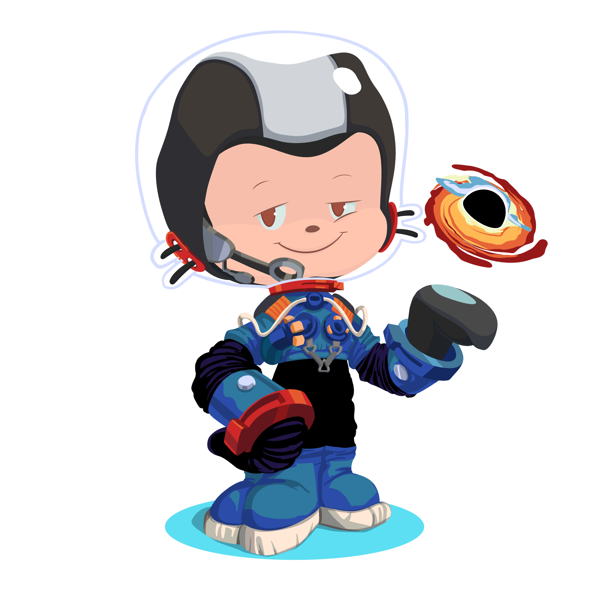

<!-- <p align="center">
  
</p> -->
<p align="center">
  
</p>
 
<div align="center">


<!-- ANIMATED HEADER -->
<!--  -->

<!-- TYPING ANIMATION -->
<!-- <a href="https://git.io/typing-svg">
  
</a> -->

<!-- PROFILE BADGES -->
<p>
  
  <a href="https://www.linkedin.com/in/tushar-singla-aab67b387/"></a>
  <a href="mailto:tusharsingla22222@gmail.com"></a>
  <a href="https://github.com/Tushar8466"></a>
</p>

</div>

---

<div align="center">
  

</div>
## 🧑‍💻 About Me

```typescript
const tushar = {
  name: "Tushar Singla",
  role: "AI-Driven Full-Stack Developer",
  education: "B.Tech CSE @ Newton School of Technology × Ajeenkya DY Patil University, Pune",
  currentFocus: ["Computer Vision", "Machine Learning", "Full-Stack Web Dev"],
  techPhilosophy: "Merge AI with real-world applications to create meaningful impact",
  openTo: ["Collaborations", "Open Source", "Internships", "Hackathons"],
  funFact: "I debug with console.log and I'm not ashamed 😄"
};
```

---

## 🛠️ Tech Stack

### 💻 Languages — Animated Moving Logos

<div align="center">
  
  &nbsp;&nbsp;
  
  &nbsp;&nbsp;
  
  &nbsp;&nbsp;
  
  &nbsp;&nbsp;
  
  &nbsp;&nbsp;
  
  &nbsp;&nbsp;
  
  &nbsp;&nbsp;
  
  &nbsp;&nbsp;
  
  &nbsp;&nbsp;
  
  &nbsp;&nbsp;
</div>


### 🏷️ Also In My Stack — Badges

<p align="center">
  
  
  
  
  
  
  
  
  
  
  
  
  
  
  
  
</p>

---

## 🌍 Open Source Contributions

> 🏆 Proud contributor to **[JSON Schema](https://json-schema.org/)** — the open standard powering data validation across the web!

<div align="center">

| # | Project | Pull Request | Status |
|:-:|---------|:------------:|:------:|
| 1 | 🔷 **json-schema-org/website** | [PR #2329](https://github.com/json-schema-org/website/pull/2329) |  |
| 2 | 🔷 **json-schema-org/website** | [PR #2299](https://github.com/json-schema-org/website/pull/2299) |  |
| 3 | 🔷 **json-schema-org/website** | [PR #2282](https://github.com/json-schema-org/website/pull/2282) |  |
| 4 | 🟠 **XplnHUB/xplnhub-insight-py** | [PR #56](https://github.com/XplnHUB/xplnhub-insight-py/pull/56) |  |
| 5 | 🟠 **XplnHUB/xplnhub-insight-py** | [PR #53](https://github.com/XplnHUB/xplnhub-insight-py/pull/53) |  |
| 6 | 🟠 **XplnHUB/xplnhub-insight-py** | [PR #51](https://github.com/XplnHUB/xplnhub-insight-py/pull/51) |  |

</div>

---

## 📊 GitHub Analytics

<div align="center">


&nbsp;&nbsp;


<br/><br/>


<br/><br/>


</div>

---

## 🏆 GitHub Trophies

<div align="center">
  
</div>

---

## 💡 Quote I Live By

<div align="center">
  
</div>

---

## 🌐 Find Me On — Animated Social Icons

<div align="center">

<a href="https://www.linkedin.com/in/tushar-singla-aab67b387/" target="_blank">
  
</a>
&nbsp;&nbsp;


---

<!-- ---

<!-- ## 🐙 Octodex -->

<div align="center">
  
  <!-- 
  
  
  
  
   -->
</div>

</div>

--- -->

## 🤝 Let's Connect

<div align="center">

| Platform | Link |
|:--------:|:----:|
| 💼 LinkedIn | [tushar-singla-aab67b387](https://www.linkedin.com/in/tushar-singla-aab67b387/) |
| 🐙 GitHub | [Tushar8466](https://github.com/Tushar8466) |
| 📧 Email | [tusharsingla22222@gmail.com](mailto:tusharsingla22222@gmail.com) |

<br/>


</div>

---

<div align="center">
  <sub>⭐ If you find my work interesting, consider starring my repos — it keeps me motivated! ⭐</sub><br/>
  <sub>Built with ❤️ by <b>Tushar Singla</b></sub>
</div>
